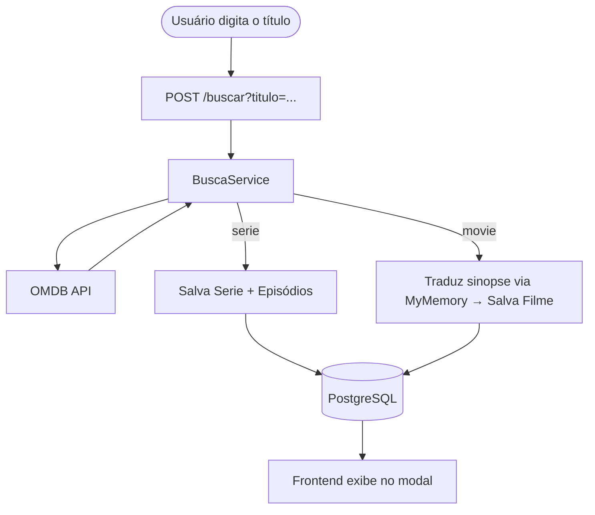

# 🎬 MarkFilmes

> Plataforma fullstack de catálogo de filmes e séries com busca real e tradução automática.


---

## 📌 Sobre o projeto

O **MarkFilmes** é uma aplicação fullstack construída do zero com Java e Spring Boot no backend e HTML/CSS/JavaScript puro no frontend. O sistema consome a **OMDB API** para buscar dados reais de filmes e séries, traduz as sinopses automaticamente via **MyMemory API** e persiste tudo em um banco **PostgreSQL**.

O frontend foi desenvolvido sem frameworks apenas ES Modules, Fetch API e CSS simples mas moderno com foco em uma experiência visual próxima de uma plataforma de streaming.

---

## ✨ Funcionalidades

| Feature | Descrição |
|---|---|
| 🔍 Busca por título | Pesquisa na OMDB em tempo real e salva automaticamente no banco |
| 🌐 Tradução automática | Sinopses traduzidas do inglês para o português via MyMemory API |
| 🎠 Carrossel infinito | Cards flutuantes com scroll automático e pausa no hover |
| 🎭 Modal fullscreen | Detalhe do título com backdrop desfocado e animação de entrada |
| ❤ Favoritos | Sistema de favoritos persistido no LocalStorage com página dedicada |
| 📂 Filtro por gênero | Ação, Comédia, Drama, Crime, Aventura |
| 📺 Temporadas e episódios | Listagem completa por temporada diretamente no modal |
| 📄 Swagger UI | Documentação interativa de todos os endpoints da API |

---

## 🛠️ Stack

### Backend
- **Java 21** — linguagem principal
- **Spring Boot 3.3** — framework web
- **Spring Data JPA + Hibernate** — persistência
- **PostgreSQL** — banco de dados relacional
- **SpringDoc OpenAPI (Swagger)** — documentação da API
- **OMDB API** — fonte de dados de filmes e séries
- **MyMemory API** — tradução de sinopses

### Frontend
- **HTML5 + CSS3** — estrutura e estilo
- **JavaScript ES Modules** — modularização sem framework
- **Fetch API** — consumo da API REST
- **LocalStorage** — persistência de favoritos

---

## 📡 Endpoints da API

### 🎬 Filmes
| Método | Rota | Descrição |
|---|---|---|
| `GET` | `/filmes` | Lista todos os filmes |
| `GET` | `/filmes/{id}` | Busca filme por ID |
| `GET` | `/filmes/top5` | Top 5 por avaliação |
| `GET` | `/filmes/lancamentos` | Últimos adicionados |
| `GET` | `/filmes/categoria/{genero}` | Filtra por gênero |

### 📺 Séries
| Método | Rota | Descrição |
|---|---|---|
| `GET` | `/series` | Lista todas as séries |
| `GET` | `/series/{id}` | Busca série por ID |
| `GET` | `/series/top5` | Top 5 por avaliação |
| `GET` | `/series/lancamentos` | Últimas adicionadas |
| `GET` | `/series/categoria/{genero}` | Filtra por gênero |
| `GET` | `/series/{id}/temporadas/todas` | Todos os episódios |
| `GET` | `/series/{id}/temporadas/{numero}` | Episódios de uma temporada |

### 🔍 Busca
| Método | Rota | Descrição |
|---|---|---|
| `POST` | `/buscar?titulo={titulo}` | Busca na OMDB e salva no banco |

> 📖 Documentação completa disponível em `http://localhost:8080/swagger-ui.html`
<div align="center">


</div>

---

## 🚀 Como executar

### Pré-requisitos
- Java 21+
- Maven
- PostgreSQL rodando localmente
- Chave gratuita da [OMDB API](https://www.omdbapi.com/apikey.aspx)

### 1. Clone o repositório
```bash
git clone https://github.com/seu-usuario/markfilmes.git
cd markfilmes
```

### 2. Configure o banco de dados
No PgAdmin ou psql, crie o banco:
```sql
CREATE DATABASE markfilmes;
```

### 3. Configure o `application.properties`
```properties
spring.datasource.url=jdbc:postgresql://localhost:5432/markfilmes
spring.datasource.username=postgres
spring.datasource.password=sua_senha
omdb.api.url=https://www.omdbapi.com/?t=
omdb.api.key=sua_chave_omdb
```

### 4. Suba o backend
```bash
cd markFilmes
mvn spring-boot:run
```

### 5. Abra o frontend
No VS Code, use a extensão **Live Server** e abra o `index.html`.

---

## 🗂️ Estrutura do projeto

```
markfilmes/
├── markFilmes/                         # Backend Spring Boot
│   └── src/main/java/br/com/markFilmes/
│       ├── controller/                 # BuscaController, FilmeController, SerieController
│       ├── service/                    # BuscaService, SerieService, ConsumoApi
│       │   └── traducao/              # ConsultaMyMemory
│       ├── repository/                 # FilmeRepository, SerieRepository
│       ├── model/                      # Entidades JPA + Records de dados OMDB
│       ├── dto/                        # SerieDTO, EpisodioDTO
│       └── config/                     # Cors, SwaggerConfig
│
└── front_markFilmes/                   # Frontend puro
    ├── index.html                      # Home
    ├── filmes.html                     # Página de filmes
    ├── series.html                     # Página de séries
    ├── favoritos.html                  # Página de favoritos
    ├── detalhes.html                   # Detalhe de série 
    ├── detalhes-filmes.html            # Detalhe de filme 
    ├── css/
    │   ├── home.css                    # Layout, carrossel, modal, cards
    │   └── detalhes.css               # Página de detalhe
    └── scripts/
        ├── carousel.js                 # Criação de cards e carrossel infinito
        ├── modal.js                    # Modal fullscreen com backdrop
        ├── favoritos.js                # Gerenciamento de favoritos (LocalStorage)
        ├── busca.js                    # Módulo de busca
        ├── index.js                    # Lógica da home
        ├── filmes.js                   # Lógica da página de filmes
        ├── series.js                   # Lógica da página de séries
        └── pag-favoritos.js            # Renderização da página de favoritos
```

---

## 🔄 Fluxo de busca



---

## 📝 Licença

Projeto desenvolvido para fins educacionais.

---

## 👤 Autor

Desenvolvido por **Marcus** — conecte-se no [LinkedIn](https://linkedin.com/in/seu-perfil).
